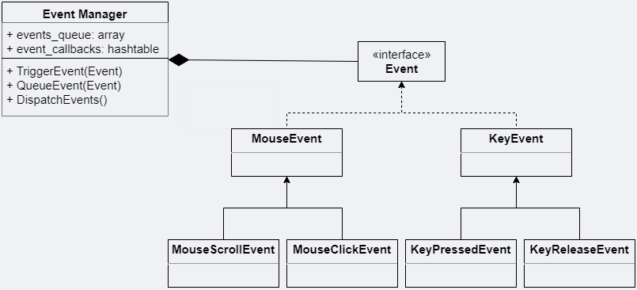
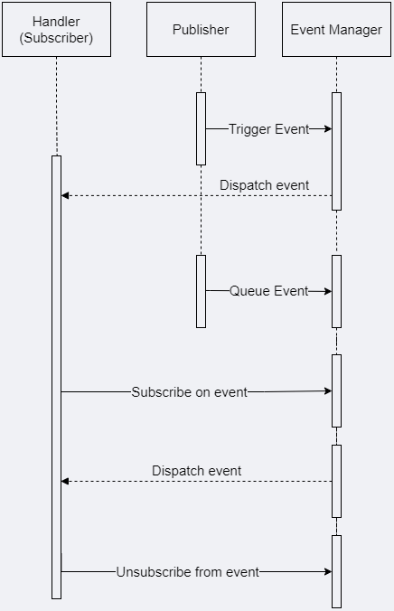

Event system is one of the engine core subsystem since we need to transfer data between different subsystems.

I was thinking about making non-blocking event system with queue feature and flexibility of use.

<h2 align="center"> Brief overview </h2>

Let's see what are the key components of our event system and how they interact with each other.
 
 
Firstly, I need to say that we will use some logic of publisher-subscriber pattern, but without correspond classes, just their logic.

So, we have the next components:
- Publisher. In our case - any code that send an event.
- Manager (bus, pool or any other name that you like). Main job - queue events and dispatch them.
- Subscriber/Handler. Just a function that can be a class member function or lambda.
- Event. User-defined (Event interface realization) class, that can be processed by manager by uuid.

Let's try to visualize Event and Manager on the class diagram.
We will not display any "publisher" or "subscriber" classes, because they are only user-dependent.

   

Next step is to visualize Publisher-Manager-Subscriber interaction on sequence diagram.

   

<h2 align="center"> Implementation </h2>

<h3 align="center">Event</h3>
Let's start our implementation from the core messaging thing - event.

Our Event interface is pretty simple:

class Event {
public:
   virtual const std::string GetEventType() const = 0;

public:
   bool Handled { false };
};


The main point is that every custom Event should have unique identifier, which we will use later in our manager.
For simplicity I will use generated string here, but I would recommend you to hash such strings. I've already added hashed strings usage to my engine, so you can check it out [here](https://github.com/denyskryvytskyi/ElvenEngine/tree/master/Engine/src/Events).

Let me to show you example of custom event:

class WindowResizeEvent : public Event {
public:
    WindowResizeEvent(unsigned int width_, unsigned int height_)
        : width(width_)
        , height(height_)
    {
    }

    const std::string GetEventType() const override { return "7CCF9526-19A3-431E-B9CB-B6AA7C775469" };

public:
    unsigned int width { 0 };
    unsigned int height { 0 };
};


You can make some improvements (if you want), like more convenient uuid definition or debug tostring function (you can find my code [here](https://github.com/denyskryvytskyi/ElvenEngine/blob/master/Engine/src/Events/Event.h))

<h3 align="center"> Event handler </h3>
Fine, now we need to implement event handler. Our handler is just a function (member function or lambda). To hold this type we will use std::function:

template<typename EventType>
using EventHandler = std::function<void(const EventType& e)>;


Let's implement event handler wrapper that will be stored in EventManager. I will use [Template Method](https://refactoring.guru/design-patterns/template-method) design pattern (template magic &#128512;) to be able to store any type of event handler with the appropriate event type reference (instead of unsafe pointer to Event):

class EventHandlerWrapperInterface {
public:
    void Exec(const Event& e)
    {
        Call(e);
    }

    virtual std::string GetType() const = 0;

private:
    virtual void Call(const Event& e) = 0;
};

template<typename EventType>
class EventHandlerWrapper : public EventHandlerWrapperInterface {
public:
    explicit EventHandlerWrapper(const EventHandler<EventType>& handler)
        : m_handler(handler)
        , m_handlerType(m_handler.target_type().name()) {};

private:
    void Call(const Event& e) override
    {
        if (e.GetEventType() == EventType::GetStaticEventType()) {
            m_handler(static_cast<const EventType&>(e));
        }
    }

    std::string GetType() const override { return m_handlerType; }

    EventHandler<EventType> m_handler;
    const std::string m_handlerType;
};


I think that the code above pretty understandable without in depth explanation. But if you stuck - don't panic, just leave a comment below and I will try to help you.

<h3 align="center"> Event Manager </h3>
The next code block is our event manager class:


class EventManager {
public:
   void Shutdown();

   void Subscribe(const std::string& eventId, const std::unique_ptr<EventHandlerWrapperInterface>&& handler);
   void Unsubscribe(const std::string& eventId, const std::string handlerName);
   void TriggerEvent(const Event& event);
   void QueueEvent(std::unique_ptr<Event>&& event);
   void DispatchEvents();

private:
   std::vector<std::unique_ptr<Event>> m_eventsQueue;
   std::unordered_map<std::string, std::vector<std::unique_ptr<EventHandlerWrapperInterface>> m_subscribers;
};

extern EventManager gEventManager;


I've created global variable for our manager, but it has some disadvantages with initialization order and multhireading perspective. So, you are free to make it local variable (maybe in Application class or whatever).

Also I've made useful functions to interact with Event Manager from any engine/game subsystem:


template<typename EventType>
inline void Subscribe(const EventHandler<EventType>& callback)
{
   UniquePtr<EventHandlerWrapperInterface> handler = std::make_unique<EventHandlerWrapper<EventType>>(callback);
   gEventManager.Subscribe(EventType::GetStaticEventType(), std::move(handler);
}

template<typename EventType>
inline void Unsubscribe(const EventHandler<EventType>& callback)
{
   const std::string handlerName = callback.target_type().name();
   gEventManager.Unsubscribe(EventType::GetStaticEventType(), handlerName);
}

inline void TriggerEvent(const Event& triggeredEvent)
{
   gEventManager.TriggerEvent(triggeredEvent);
}

inline void QueueEvent(UniquePtr<Event>&& queuedEvent)
{
    gEventManager.QueueEvent(std::forward<UniquePtr<Event>>(queuedEvent));
}


As you can see, we use two data structures:
- vector for events queue, which contains pointer to events with different types.
- unordered_map (hashtable implementation from standard library), where key is event uuid (will be explained in Event section) and value - vector of subscribers-callbacks.

Subscribe/Unsubscribe functions should be called from subscriber's code.
TriggerEvent/QueueEvent function should be called from pusblisher's code.

DispatchEvents should be called from the main game loop on every, like this:


void Application::Run()
{
   ...
   while(isApplicationRun)
   {
      Render();
      ProcessInput();

      gEventManager.DispatchEvents();
   }
   ...
}


Definition of our manager mechanism is next:


void EventManager::Shutdown()
{
   m_subscribers.clear();
}

void EventManager::Subscribe(std::uint32_t eventId, UniquePtr<EventHandlerWrapperInterface>&& handler)
{
    auto subscribers = m_subscribers.find(eventId);
    if (subscribers != m_subscribers.end()) {
        auto& handlers = subscribers->second;
        for (auto& it : handlers) {
            if (it->GetType() == handler->GetType()) {
                EL_ASSERT(false, "Attempting to double-register callback");
                return;
            }
        }
        handlers.emplace_back(std::move(handler));
    } else {
        m_subscribers[eventId].emplace_back(std::move(handler));
    }
}

void EventManager::Unsubscribe(std::uint32_t eventId, const std::string& handlerName)
{
    auto& handlers = m_subscribers[eventId];
    for (auto& it = handlers.begin(); it != handlers.end(); ++it) {
        if (it->get()->GetType() == handlerName) {
            it = handlers.erase(it);
            return;
        }
    }
}

void EventManager::TriggerEvent(const Event& event_)
{
    for (auto& handler : m_subscribers[event_.GetEventType()]) {
        handler->Exec(event_);
    }
}

void EventManager::QueueEvent(UniquePtr<Event>&& event)
{
    m_eventsQueue.emplace_back(std::move(event));
}

void EventManager::DispatchEvents()
{
    for (auto& eventIt = m_eventsQueue.begin(); eventIt != m_eventsQueue.end();) {
        if (!eventIt->get()->isHandled) {
            TriggerEvent(*eventIt->get());
            eventIt = m_eventsQueue.erase(eventIt);
        } else {
            ++eventIt;
        }
    }
}


<h3 align="center">Handler example</h3>

Let's see how handler can interact with event manager.

For example, we have camera class, that create projection matrix.
Projection matrix depennds on window size. So, we need to handle window resize event to recalculate projection matrix every time we change window size.

Firstly, we add member function `OnWindowResizeEvent`, that will be our callback for event.


class Camera {
public:
   Camera()
   ~Camera()
   ... camera class code ...

   void OnWindowResizeEvent(const WindowResizeEvent& e);

private:
   EventHandler<WindowResizeEvent> m_windowResizeHandler;
};


Our ctor/dtor and callback definition (we initialize std::function handler with lambda):


Camera::Camera()
   : m_windowResizeHandler([this](const Events::WindowCloseEvent& e) { OnWindowClose(e); })
{
   Subscribe<WindowResizeEvent>(m_windowResizeHandler);
}

Camera::~Camera()
{
   Unsubscribe<WindowResizeEvent>(m_windowResizeHandler);
}

void Camera::OnWindowResized(const WindowResizeEvent& e)
{
   const int width = e.Width;
   const int height = e.Height;

   ... recalculate projection matrix by new window size and aspect ratio ...
}


<h3 align="center">Publisher example</h3>

The last component of our system - publisher.
Actually our publisher is just a function call, TriggerEvent or QueueEvent.

For example, we want to trigger WindowResizeEvent and queue WindowCloseEvent event from window class:


class Window
{
public:
   ... window class code ...

   void Update
   {
      ... code ...

      setWindowResizeCallback( {
         TriggerEvent(WindowResizeEvent(width, height));
      })

      setWindowCloseCallback(m_window,  {
         UniquePtr<WindowCloseEvent> closeEvent = std::move(MakeUniquePtr<WindowCloseEvent>());
         QueueEvent(std:move(closeEvent));
    });
   }

private:
   GLFWwindow* m_window { nullptr };
}


<h3 align="center"> P.S. </h3>

I hope you will find something interesting and useful from this post.
I think I will add multithreading support to event system when I will be experimenting with multithreading in the engine and I will write post about it later or expand this post with new changes and improvements.
Feel free to comment and write yor thoughts about my implementation.

Thank you for attention!

### References

- Game Coding Complete, 4th ed. *Mike McShaffry, David Graham*.
- Game Programming Patterns. *Robert Nystrom*.
- Game Engine Architecture, 3rd ed. *Jason Gregory*.
