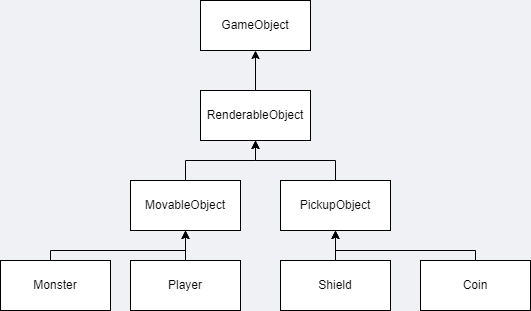
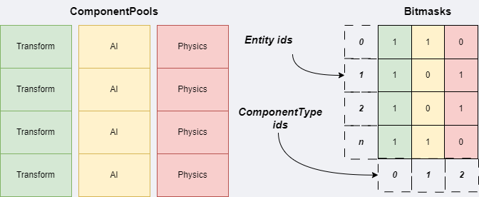

 <i>"The way you organize data directly impacts performance"</i>
 
- Robert Nystrom

The article turned out to be quite large, so here is the content:
- <a href="#intro" class="content">Part 1. Theory</a>
   - <a href="#object_centric" class="content">Object-centric approach</a>
      - <a href="#is_a" class="content">Is-a design. Unreal Engine Actors</a>
      - <a href="#is_a_cons" class="content">Problems of the is-a design</a>
      - <a href="#has_a" class="content">Has-a design. Composition over inheritance</a>
      - <a href="#has_a_cons" class="content">Problems of the has-a design</a>
   - <a href="#property_centric" class="content">Property-centric approach and data locality pattern</a>
   - <a href="#ecs" class="content">ECS introduction</a>
- <a href="#implementation" class="content">Part 2. My implementation</a>
   - <a href="#implementation_mvp" class="content">First iteration: MVP</a>
   - <a href="#implementation_scene" class="content">Second iteration</a>
      - <a href="#scene" class="content">Scene</a>
      - <a href="#system_part" class="content">System part of ECS</a>
      - <a href="#scripts" class="content">Behavior components/scripts</a>
      - <a href="#improvements" class="content">Potential improvements</a>
   - <a href="#final" class="content">Final thoughts</a>
- <a href="#references" class="content">References</a>

<h2 id="intro">Intro</h2>
Game entities (game objects) are the basic building blocks of a game. There are a lot of different approaches and techniques to build a system behind game entities.
The game development community has increasingly adopted the Entity-Component System (ECS) architecture for building modern game engines and games.

But before we dive into ECS architecture I would like to mention other designs.

<b>What could we do? </b>

Jason Gregory (lead game engine developer from Naughty Dog) has an excellent introduction to an entity component system in his book "Game Engine Architecture".
He uses the term "runtime object model" to describe a game entity.
I like how he highlights two basic architectural styles:
- Object-centric
- Property-centric

Let's take a closer look at them.

<h2 id="object_centric">Object-centric</h2>
In this architecture, each logical game object is implemented as an instance of a class or interconnected class instances. Many different designs are possible using this approach.
I will show you two of them just to get the main idea.

<h3 id="is_a">Is-A design</h3>

The first one uses well-known an is-a type of class hierarchy that is based on inheritance and polymorphism. In this type of hierarchy, a derived class is a more specific version of its base class and can be used anywhere that the base class is expected. It's the most intuitive and straightforward way to
represent a collection of interrelated game object types.
Using this design our game class hierarchy may look like this:

   

A game object class hierarchy usually begins small and simple, and in that
form, it can be a powerful and intuitive way to describe a collection of game
object types. However, as class hierarchies grow, they have a complex structure. Let's see just a little part of the <a href="https://docs.unrealengine.com/5.0/en-US/API/Runtime/Engine/GameFramework/AActor/AActorHierarchy/" target="_blank" class="content">AActor base class</a> hierarchy used in Unreal Engine (actually it has more than 300 inherited classes):

   

<h3 id="is_a_cons">Problems of the is-a design</h3>

This so-called monolithic class hierarchy tends to cause problems for the game development
team for a wide range of reasons:
- The deeper a class lies within a class hierarchy, the harder it is to understand,
maintain and modify. This is because to understand a class, you need
to understand all of its parent classes as well.
- One of the biggest problems with any hierarchy is that it can only classify objects along a single “axis” — according to one particular set of criteria — at each tree level. Once the criteria have been chosen for a particular hierarchy, it becomes difficult or impossible to classify along an entirely different set of “axes".
- <a href="https://www.geeksforgeeks.org/multiple-inheritance-in-c/" target="_blank" class="content">Multiple inheritance</a> can be the key and solution to resolving logic problems in such a tree hierarchy. However, multiple inheritance in C++ poses several practical problems. For example, it can lead to an object that contains multiple copies of its base class members — a condition known as the <a href="https://en.wikipedia.org/wiki/Multiple_inheritance#The_diamond_problem" target="_blank" class="content">“deadly diamond” or “diamond of death”.</a> So, game developers usually limit the use of multiple inheritance in their class hierarchy.

   
    <i>Deadly diamond. "You had to fight evil not join it"</i>

- Dynamic binding (runtime polymorphism/virtual function calls) leads to a slight overhead in terms of performance, as the compiler needs to generate extra code to support dynamic binding. Moreover, it affects memory too because an instance of an inherited class also contains a pointer (vPointer) to the virtual table (vTable) associated with it in its memory layout, as you can see in the diagram below. Of course, you can say “This overhead is often outweighed by the advantages of code flexibility and maintainability that come with using virtual functions” but it’s definitely a tradeoff when developing a complex architecture.

   

<h3 id="has_a">Has-A design</h3>
Converting “is-a” relationships into “has-a” relationships can be a useful technique for reducing the width, depth, and complexity of a game’s class hierarchy. Let’s imagine we have a game object that should have render, animation, and physics logic. Using the has-a technique we could make classes relationships looks like this:

   

In code, it may look like this:

class GameObject {
    MeshInstance* m_meshInstance { nullptr };
    AnimationController* m_animController { nullptr };
    Transform* m_transform { nullptr };
    RigidBody* m_rigidBody { nullptr };
};


Another flexible approach is to implement GameObject with a generic component array:

   

The code may look like this:

class GameObject {
   // ...
   void AddComponent(std::shared_ptr<GenericComponent> component);
   
   std::unordered_map<ComponentId, std::shared_ptr<GenericComponent>> m_components;
   // ...
};

The benefit of this technique is that we can create different game object types using the same class.

<h3 id="has_a_cons">Problems of the has-a design</h3>

Let’s imagine we used a has-a design for our entity component system and our main game loop may look like so:


while (!gameOver)
{
// Process AI.
for (int i = 0; i < numEntities; i++)
{
   gameobjects[i]->GetAIComponent()->update();
}
// Update physics.
for (int i = 0; i < numEntities; i++)
{
   gameobjects[i]->GetPhysicsComponent()->update();
}
// Update animations.
for (int i = 0; i < numEntities; i++)
{
   gameobjects[i]->GetAnimationComponent()->update();
}
// Draw to screen.
for (int i = 0; i < numEntities; i++)
{
   gameobjects[i]->GetRenderComponent()->render();
}



Nothing wrong at the first glance. But let's talk about cache. A <a href="https://en.wikipedia.org/wiki/CPU_cache" target="_blank" class="content">cache</a> is a small memory chunk of contiguous memory placed inside the CPU chip. Data is transferred between memory and cache in blocks of fixed size, called <b>cache lines</b>. If the next byte of data you need happens to be in that chunk, the CPU reads it straight from the cache, which is much faster than hitting RAM. Successfully finding a piece of data in the cache is called a
<b>cache hit</b>. If it can’t find it in there and has to go to main memory, that’s a <b>cache miss</b>.

When we use the has-a design we have a memory image similar to this visualization:

   

I took this image from Robert Nystrom's great book "Game Programming Patterns". He described entity component system and problems with CPU caching in the (<a href="https://gameprogrammingpatterns.com/data-locality.html" target="_blank" class="content">Data Locality pattern</a>) chapter. I would strongly recommend you read it to get more details.

Briefly speaking, we have no idea how components of every type are lying in the memory. They are definitely not placed сontiguously in memory and so we will have cache misses and the performance of our game will be affected.

What we can do to improve our performance and make our system more cache-friendly? Let’s see a property-centric approach.

<h2 id="property_centric">Property-centric and data locality</h2>

Jason Gregory's <b>Property-centric</b> approach and Robert Nystrom's <b>Data locality</b> pattern are all about the same way to organize memory for game entities.

Instead of having game objects as holders for components, we’ll have a big array for each type of component: a flat array of AI components, another for physics, another for animation, and another for rendering.

Like this:


AIComponent* aiComponents = new AIComponent[MAX_ENTITIES];
PhysicsComponent* physicsComponents = new PhysicsComponent[MAX_ENTITIES];
AnimationComponent* animationComponents = new AnimationComponent[MAX_ENTITIES];
RenderComponent* renderComponents = new RenderComponent[MAX_ENTITIES];


Now our game loop may look like so:


while (!gameOver)
{
   // Process AI.
   for (int i = 0; i < numEntities; i++)
   {
      aiComponents[i].update();
   }
   // Update physics.
   for (int i = 0; i < numEntities; i++)
   {
      physicsComponents[i].update();
   }
   // Update animations.
   for (int i = 0; i < numEntities; i++)
   {
      animationComponents[i].update();
   }
   // Draw to screen.
   for (int i = 0; i < numEntities; i++)
   {
      renderComponents[i].render();
   }
  // ...
}


Instead of skipping around in memory, we’re doing a straight crawl through three contiguous arrays.
Next simplified memory image from the "Game programming patterns" book illustrates it:

   

<h2 id="ecs">ECS introduction</h2>
Now let's talk about <a href="https://en.wikipedia.org/wiki/Entity_component_system" target="_blank" class="content">ECS</a>.

Actually, the terms Entity-Component System and ECS are often used interchangeably, but the term ECS has become more commonly used in recent years to refer specifically to a variant of the Entity-Component System architecture that is based on a <a href="https://en.wikipedia.org/wiki/Data-oriented_design" target="_blank" class="content">data-oriented design</a>.
I will use the ECS term from now on to describe a system that I will be implementing.

Typical ECS architecture consists of the following parts:

- <b>Entity</b>. Usually, just an integer number using like game object id.
- <b>Component</b>. Game object data. So-called <a href="https://en.wikipedia.org/wiki/Passive_data_structure" target="_blank" class="content">POD</a> (plain old data) C++ structure/class without behavior.
- <b>System</b>. A system is a process that acts on all entities with the desired components. It contains game object behavior.

<h1 id="implementation">My implementation</h1>
I will follow ECS architecture style I described above but I have a few points I would change:

First of all, I don't like the idea of POD classes for the components. It can be useful to have some functions that help to set some behavior for all components of a particular type.

Secondly, a system can be represented both as a class and a single function, so I think this depends on the logic we want to have.

The main points I want my ECS to follow:
- Not overcomplicated. I don't want to have a system that itself as huge as the entire engine.
- Data-oriented design principle in the core.
- Usability and extensibility. It's easy to work with new entities and components.
- It has a convenient interface to use.

<h2 id="implementation_mvp">First iteration: MVP</h2>

In the first iteration of my ECS, I will implement basic <b>Entity</b> and <b>Component</b> logic and show you how you already can use such a small system. Then I will improve the system for better usability and extensibility point, also I will add an optional <b>System</b> part of the architecture.

You can find final version of the ECS on my <a href="https://github.com/denyskryvytskyi/ElvenEngine/tree/master/Engine/src/Scene" target="_blank" class="content">Github repository</a>.

Let's start coding.

### Entity

As I described above Entity is represented as an integer number (unique identifier).
Also I would add additional constant to indicate invalid entity with value 0.
And of course we need a function to generate next Entity id. We have several options how to generate new id:
- using monotonic id increment
- random generator
- GUID
- etc.

Actually, I've already implemented a serialization system for my entities and I decided that keeping monotonic ID is enough and appropriate for that, so we will use this option.
By the way, I use atomic type to synchronize access to the counter when multiple threads tried to get access to it.
Our code will be the next:


// Entity.h
using Entity = uint64_t;
constexpr Entity INVALID_ENTITY_ID = 0;

inline Entity GenerateEntityId()
{
   static std::atomic<Entity> next { INVALID_ENTITY_ID + 1 };
   return next.fetch_add(1);
}


### Component

Firstly, we need to distinguish component types. I've decided to make ComponentTypeId, helper constants, and logic to get next component type id:

// Component.h
#include <bitset>

using ComponentTypeId = std::uint64_t;

constexpr ComponentTypeId INVALID_COMPONENT_TYPE_ID = 0;
constexpr std::uint32_t MAX_ENTITIES_PER_COMPONENT = 100'000;
constexpr std::uint32_t MAX_COMPONENTS = 32;

using ComponentMask = std::bitset<MAX_COMPONENTS>;

class ComponentTypeIdHolder {
public:
    static ComponentTypeId s_componentTypeCounter;
};

template<class ComponentType>
inline ComponentTypeId GetComponentTypeId()
{
    static ComponentTypeId id = INVALID_COMPONENT_TYPE_ID;
    if (id == INVALID_COMPONENT_TYPE_ID) {
        if (ComponentTypeIdHolder::s_componentTypeCounter < MAX_COMPONENTS)
            id = ++ComponentTypeIdHolder::s_componentTypeCounter;
        else {
            EL_CORE_ERROR("Maximum component types limit reached = {0}!", MAX_COMPONENTS);
            assert(false);
            return 0;
        }
    }

    return id;
}


I think there is nothing difficult to understand.
We have a static variable that holds the used component type count.
Also, we have a global function to get the following component type id using this variable.

Now, let's see how we want to work with our components.
We want to create a pool of components with a particular component type.
Since we may have a lot of components of one type <b>std::vector</b> container will be the logical choice for our pool.
Also, we may want to have generic add/get/remove possibilities for that.
So, I will create a skeleton for our <b>generic ComponentPool</b> class like this:


// Component.h
template<class ComponentType>
class ComponentPool {
public:
   ComponentType& AddComponent()
   {
      // ...
   }

   void RemoveComponent(Entity entity)
   {
      // ...
   }

   ComponentType& GetComponent(Entity entity)
   {
      // ...
   }

   std::vector<ComponentType>& GetComponents()
   {
      return m_components;
   }

   const std::vector<ComponentType>& GetComponents() const
   {
      return m_components;
   }

private:
   std::vector<ComponentType> m_components;
};


How we will distinguish components per particular entity? 
We need to hold information about an entity-component connection.

For that, I add a separate pool of entities that have this type of component using <b>std::vector</b>, where
<b>index</b> is a <b>component index</b> that is the same for index from <b>m_components</b> pool and <b>value</b> - an <b>entity id</b> associated with this component.

And additional <b>std::unordered_map</b> where <b>key</B> is an <b>Entity id</b> and <b>value</b> - <b>component index</b> from the <b>m_components</b> pool associated with this entity.

Here is a visualization of these relationships:

   

Why don't you just use vectors of components, where an index is an Entity id, you may ask.
Well, you can, but then component arrays will have a memory layout like this:

   

There is a problem when a certain component is used infrequently and the array stores enough memory for all active entities.
It's a reason why I use an additional vector and unordered map to support entity-component connection.
It will have a performance hit too when we are processing components of different types at one for loop, but let's talk about it later.


// Component.h
template<class ComponentType>
class ComponentPool {
// ...

private:
   std::vector<ComponentType> m_components;
   std::vector<Entity> m_entities;
   std::unordered_map<Entity, std::uint64_t> m_entityToComponentIndex;
};


Cool, now let's fill our functions with all the logic we need.
Complete version of the class will be the next:


// Component.h
template<class ComponentType>
class ComponentPool {
public:
   ComponentPool()
   {
      m_components.reserve(MAX_ENTITIES_PER_COMPONENT);
   }

   void Clear()
   {
      m_components.clear();
      m_entities.clear();
      m_entityToComponentIndex.clear();
   }

   template<typename... Args>
   ComponentType& AddComponent(Entity entity, Args&&... args)
   {
      if (m_components.size() >= MAX_ENTITIES_PER_COMPONENT) {
         EL_CORE_ERROR("Entities limit reached for this component type = {0}!", MAX_COMPONENTS);
         assert(false);
         return m_invalidComponent;
      }

      m_entityToComponentIndex.insert({ entity, m_components.size() });
      m_components.emplace_back(std::forward<Args>(args)...);
      m_entities.emplace_back(entity);
      return m_components.back();
   }

   ComponentType& AddComponent(Entity entity, ComponentType&& component)
   {
      if (m_components.size() >= MAX_ENTITIES_PER_COMPONENT) {
         EL_CORE_ERROR("Entities limit reached for this component type = {0}!", MAX_COMPONENTS);
         assert(false);
         return m_invalidComponent;
      }

      m_entityToComponentIndex.insert({ entity, m_components.size() });
      m_components.emplace_back(std::move(component));
      m_entities.emplace_back(entity);
      return m_components.back();
   }

   void RemoveComponent(Entity entity) override
   {
      auto it = m_entityToComponentIndex.find(entity);
      if (it != m_entityToComponentIndex.end()) {
         const std::uint64_t componentIndex = it->second;

         if (componentIndex < m_components.size() - 1) {
               // replace dead component with the last one
               m_components[componentIndex] = std::move(m_components.back());
               m_entities[componentIndex] = std::move(m_entities.back());

               const Entity movedComponentEntityId = m_entities.back();
               m_entityToComponentIndex[movedComponentEntityId] = componentIndex; // new mapping for moved component
         }

         m_entityToComponentIndex.erase(it);
      }

      if (!m_components.empty()) {
         m_components.pop_back();
         m_entities.pop_back();
      }
   }

   Entity GetEntity(std::uint32_t componentIndex) const override
   {
      return m_entities[componentIndex];
   }

   ComponentType& GetComponent(Entity entity)
   {
      auto it = m_entityToComponentIndex.find(entity);

      if (it == m_entityToComponentIndex.end()) {
         EL_CORE_ERROR("Failed to find component by entity id={0}", entity);
         assert(false);
         return m_invalidComponent;
      }

      return m_components[it->second];
   }

   std::vector<ComponentType>& GetComponents()
   {
      return m_components;
   }

   const std::vector<ComponentType>& GetComponents() const
   {
      return m_components;
   }

private:
   std::vector<ComponentType> m_components;
   std::vector<Entity> m_entities;
   std::unordered_map<Entity, std::uint64_t> m_entityToComponentIndex;
};


Actually, MVP is ready to use in a simple manner.


#include <Entity.h>
#include <Component.h>

int main()
{
   ComponentPool<AIComponent> aiComponents;
   ComponentPool<PhysicsComponent> physicsComponents;
   ComponentPool<AnimationComponent> animationComponents;
   ComponentPool<RenderComponent> renderComponents;

   Entity player = GenerateEntityId();

   RenderComponent playerRender;
   renderComponents.AddComponent(player, playerRender);
   PhysicsComponent playerPhysics;
   physicsComponents.AddComponent(player, playerPhysics);
   AnimationComponent playerAnimation;
   animationComponents.AddComponent(player, playerAnimation);

   Entity monster = GenerateEntityId();

   RenderComponent monsterRender;
   renderComponents.AddComponent(monster, monsterRender);
   PhysicsComponent monsterPhysics;
   physicsComponents.AddComponent(monster, monsterPhysics);
   AnimationComponent monsterAnimation;
   animationComponents.AddComponent(monster, monsterAnimation);

   // update
   while (!gameOver)
   {
      for (auto& aiComponent : aiComponents.GetComponents()) {
         // process ai component
      }
      
      for (auto& physicsComponent : physicsComponents.GetComponents()) {
         // process physics component
      }
      
      for (auto& animationComponent : animationComponents.GetComponents()) {
         // process animation component
      }
      
      for (auto& renderComponent : renderComponents.GetComponents()) {
         // draw to screen using render component
      }
   }
   
   // ...

   return 0
}


Such entity-component system may be ne enough for developing small games or when developers have a possibility to extend engine code to add custom component types (ComponentPool objects) to it.

But I would try to make it more friendly for the user of the engine, so the developer won't need to think about where and how he should add new components and how to interact with it.

<h2 id="implementation_scene">Second iteration</h2>
MVP has a simple interface to use it. But as I mentioned above, I would like to have a system that is more extensibility-friendly.

<h3 id="scene">Scene</h3>

Simple games may have only one scene but comlpex big games have a lot of scenes. Every scene has its unqiue entities with particular components. So, we need to have a scene logic to support hold all information we need.

Firstly, we need to hold all Component Pools our scene has. I think <b>unordered_map</b> container where a <b>key</b> is a <b>ComponentType</b> and a value corresponds <b>Component Pool</b>.

Secondly, we need to hold all active entities of the scene. std::vector container is appropriate for this purpose (m_entitiesSignatures).

How could we know what components are connected to a particular entity?
We may use ComponentPool to check whether it has a component that is connected to the entity.
But we would need to iterate unordered_map (m_entities) in the ComponentPool which is not a good idea because we can have hundreds of thousands of entities. So, I've decided to add an additional unordered_map container (m_entitiesSignatures) in Scene class for this purpose. A <b>key</b> will be an <b>Entity id</b> and a <b>value</b> will be a <a href="https://en.wikipedia.org/wiki/Mask_(computing)" target="_blank" class="content"><b>bitmask</b></a>. Every bit in bitmask corresponds to a particular Component Type.

   

Since we will hold our ComponentPools as pointers in one container, we need to support it.
I've made an interface class for this purpose. ComponentPool class inherits this interface.


// Component.h
struct IComponentPool {
    virtual ~IComponentPool() = default;

    virtual void Clear() = 0;
    virtual void RemoveComponent(Entity entity) = 0;
    virtual Entity GetEntity(std::uint32_t componentIndex) const = 0;
};

template<class ComponentType>
class ComponentPool final : public IComponentPool {
public:
// ...
   void Clear() override
   {
      // ...
   }

   void RemoveComponent(Entity entity) override
   {
      // ...
   }

   Entity GetEntity(std::uint32_t componentIndex) const override
   {
      // ...
   }
// ...
}


The ComponentPool class functions code is the same as in the previous ComponentPool code snippet.

Now we can keep components pool in the Scene class.


// Scene.h
class Scene {
private:
   std::unordered_map<ecs::ComponentTypeId, SharedPtr<ecs::IComponentPool>> m_componentPools;
   std::vector<ecs::Entity> m_entities;
   std::unordered_map<ecs::Entity, ecs::ComponentMask> m_entitiesSignatures;
};


Let's think about the Scene interface and how we want to interact with our scene and ECS.
The main points are:
- create/destroy entity; get all entities;

// Scene.h, Scene class member function
ecs::Entity CreateEntity()
{
   const ecs::Entity id = ecs::GenerateEntityId();
   m_entitiesSignatures.insert({ id, ecs::ComponentMask() });
   m_entities.emplace_back(id);

   return id;
}

const std::vector<ecs::Entity>& GetEntities() const
{
   return m_entities;
}

void DestroyEntity(const ecs::Entity& entity)
{
   auto entityIt = std::find(m_entities.begin(), m_entities.end(), entity);

   if (entityIt != m_entities.end()) {
      auto componentMask = m_entitiesSignatures[entity];
      for (size_t i = 0; i < componentMask.size(); ++i) {
            if (componentMask.test(i)) {
               m_componentPools[i]->RemoveComponent(entity);
            }
      }
      m_entitiesSignatures.erase(entity);
      m_entities.erase(entityIt);
   }
}


- register new component type;

// Scene.h, Scene class member function
template<typename ComponentType>
void RegisterComponent()
{
   const ecs::ComponentTypeId componentTypeId = ecs::GetComponentTypeId<ComponentType>();
   auto it = m_componentPools.find(componentTypeId);
   if (it == m_componentPools.end()) {
      m_componentPools.insert({ componentTypeId, MakeSharedPtr<ecs::ComponentPool<ComponentType>>() });
   } else {
      EL_CORE_WARN("Component type is already registered with id = {0}", componentTypeId);
   }
}


- add component with or without arguments. We need to support both default constructor and constructor with arguments for our components structures;

// Scene.h, Scene class member function
template<typename ComponentType, typename... Args>
ComponentType& AddComponent(ecs::Entity entity, Args&&... args)
{
   const ecs::ComponentTypeId componentTypeId = ecs::GetComponentTypeId<ComponentType>();

   auto it = m_componentPools.find(componentTypeId);
   if (it == m_componentPools.end()) {
      EL_CORE_ERROR("Failed to add component. Component type isn't registered.");
      assert(false);

      static ComponentType invalid;
      return invalid;
   }

   auto entityIt = m_entitiesSignatures.find(entity);
   entityIt->second.set(componentTypeId);

   return std::static_pointer_cast<ecs::ComponentPool<ComponentType>>(it->second)->AddComponent(entity, std::forward<Args>(args)...);
};

template<typename ComponentType>
ComponentType& AddComponent(ecs::Entity entity, ComponentType&& component)
{
   const ecs::ComponentTypeId componentTypeId = ecs::GetComponentTypeId<ComponentType>();

   auto it = m_componentPools.find(componentTypeId);
   if (it == m_componentPools.end()) {
      EL_CORE_ERROR("Failed to add component. Component type isn't registered.");
      assert(false);
      static ComponentType invalid;
      return invalid;
   }

   auto entityIt = m_entitiesSignatures.find(entity);
   entityIt->second.set(componentTypeId);

   return std::static_pointer_cast<ecs::ComponentPool<ComponentType>>(it->second)->AddComponent(entity, std::forward<ComponentType>(component));
};


- remove component;

// Scene.h, Scene class member function
template<typename ComponentType>
void RemoveComponent(ecs::Entity entity)
{
   auto entityIt = m_entitiesSignatures.find(entity);
   const ecs::ComponentTypeId componentTypeId = ecs::GetComponentTypeId<ComponentType>();
   entityIt->second.set(componentTypeId, false);

   auto it = m_componentPools.find(componentTypeId);
   if (it == m_componentPools.end()) {
      EL_CORE_ERROR("Failed to remove component. Component type isn't registered");
      assert(false);
      return;
   }

   it->second->RemoveComponent(entity);
};


- check whether we have a component for the entity;

// Scene.h, Scene class member function
template<typename ComponentType>
bool HasComponent(ecs::Entity entity)
{
   auto entityIt = m_entitiesSignatures.find(entity);

   if (entityIt == m_entitiesSignatures.end()) {
      EL_CORE_ERROR("The entity with id={0} is not found.", entity);
      assert(false);
      return false;
   }

   const ecs::ComponentTypeId componentTypeId = ecs::GetComponentTypeId<ComponentType>();
   return entityIt->second.test(componentTypeId);
}


- get component by entity id;

// Scene.h, Scene class member function
template<typename ComponentType>
ComponentType& GetComponent(ecs::Entity entity)
{
   const ecs::ComponentTypeId componentTypeId = ecs::GetComponentTypeId<ComponentType>();
   auto it = m_componentPools.find(componentTypeId);

   if (it == m_componentPools.end()) {
      EL_CORE_ERROR("Failed to get component. Component type isn't registered.");
      assert(false);
      static ComponentType invalid;
      return invalid;
   }

   return std::static_pointer_cast<ecs::ComponentPool<ComponentType>>(it->second)->GetComponent(entity);
}


- get all components of a particular type;

// Scene.h, Scene class member function
template<typename ComponentType>
std::vector<ComponentType>& GetComponents() const
{
   const ecs::ComponentTypeId componentTypeId = ecs::GetComponentTypeId<ComponentType>();
   auto it = m_componentPools.find(componentTypeId);

   if (it == m_componentPools.end()) {
      EL_CORE_ERROR("Failed to get components. Component type isn't registered.");
      assert(false);
      return std::vector<ComponentType>();
   }

   return std::static_pointer_cast<ecs::ComponentPool<ComponentType>>(it->second)->GetComponents();
}


- check whether component type is registered;

// Scene.h, Scene class member function
template<typename ComponentType>
bool IsComponentTypeRegistered() const
{
   const ecs::ComponentTypeId componentTypeId = ecs::GetComponentTypeId<ComponentType>();
   auto it = m_componentPools.find(componentTypeId);

   return it != m_componentPools.end();
}


- get component pool by type;

// Scene.h, Scene class member function
template<typename ComponentType>
SharedPtr<ecs::ComponentPool<ComponentType>> GetComponentPool()
{
   const ecs::ComponentTypeId componentTypeId = ecs::GetComponentTypeId<ComponentType>();
   auto it = m_componentPools.find(componentTypeId);

   if (it == m_componentPools.end()) {
      EL_CORE_ERROR("Failed to get component pool. Component type isn't registered.");
      assert(false);
      return nullptr;
   }

   return std::static_pointer_cast<ecs::ComponentPool<ComponentType>>(it->second);
}


- get entity by component index.

// Scene.h, Scene class member function
template<typename ComponentType>
ecs::Entity GetEntity(std::uint32_t componentIndex) const
{
   const ecs::ComponentTypeId componentTypeId = ecs::GetComponentTypeId<ComponentType>();
   auto it = m_componentPools.find(componentTypeId);

   if (it == m_componentPools.end()) {
      EL_CORE_ERROR("Failed to get entity by component index. Component type isn't registered.");
      assert(false);
      return ecs::INVALID_ENTITY_ID;
   }

   return it->second->GetEntity(componentIndex);
}


Now, you can easily interact with ECS through the Scene interface. Like this:


   // ...
   // create scene
   Scene scene;

   // register components we need (add ComponenPool objects to the Scene container)
   scene.RegisterComponent<TrasformComponent>();
   scene.RegisterComponent<MeshComponent>();
   scene.RegisterComponent<AIComponent>();
   scene.RegisterComponent<PhysicsComponent>();
   scene.RegisterComponent<AnimationComponent>();

   // fill player entity with components
   Entity player = scene.CreateEntity();
   scene.AddComponent<RenderComponent>(player, /* args ...*/);
   scene.AddComponent<PhysicsComponent>(player, /* args ...*/);
   AnimationComponent animComponent;
   // ...
   // some work with animComponent
   // ...
   scene.AddComponent<AnimationComponent>(player, animComponent);

   // fill monster entity with components
   Entity monster = scene.CreateEntity();
   scene.AddComponent<RenderComponent>(monster, /* args ...*/);
   auto& aicomponent = scene.AddComponent<AIComponent>(monster);
   // ... 
   // some work with ai component
   // ...
   scene.AddComponent<AnimationComponent>(monster, /* args ...*/);
   scene.AddComponent<PhysicsComponent>(monster, /* args ...*/);

   // update loop
   while (!gameOver) {
      for (auto& aiComponent : scene->GetComponents<AiComponent>()) {
         // process ai component
      }

      for (auto& physicsComponent : scene->GetComponents<PhysicsComponent>()) {
         // process physics component
      }

      for (auto& animationComponent : scene->GetComponents<AnimationComponent>()) {
         // process animation component
      }

      // renderer that uses two component types
      auto& meshComponentPool = scene->GetComponentPool<MeshComponent>();
      auto& transformComponentPool = scene->GetComponentPool<TransformComponent>();

      for (uint32_t index = 0; index < meshComponentPool->GetComponents().size(); ++index) {
         auto& meshComponent = meshComponentPool->GetComponent(index);
         const ecs::Entity entity = meshComponentPool->GetEntity(index);
         auto& transformComponent = transformComponentPool->GetComponent(entity);
         // draw to screen 
      }
   }

// ...



<h3 id="system_part">Systems</h3>
As you saw in the example above you don't even need any systems to interact with entity-component system consistently. But systems could be useful for complex game/game engine architecture structures. Actually, it's just another abstractions layer.

There are different approaches to implementing System part of ECS. You may register a system with particular component types that will be used there, filter out entities on the pre-update stage, for example, etc.

But I still adhere to minimalistic ECS architecture to avoid too much abstraction.

There are next points our System part should follow:
- System interface class with OnInit, OnShutdown, OnUpdate, OnRender functions which correspond to different runtime stages.
- Engine-user may want to have a system that supports only some function stages, so we will make them optional.
- System objects will be contained inside the Scene class in the std::vector container.
- System should be registered manually using scene.
- System should have a pointer to the Scene for convenient access to the entities and components

Let's start with System interface class.


class IComponentSystem {
public:
   IComponentSystem(Scene* scenePtr)
      : m_pScene(scenePtr)
   {
      OnInit();
   }

   virtual ~IComponentSystem() = default;

   virtual void OnInit() { }
   virtual void OnShutdown() { }
   virtual void OnUpdate(float dt) { }
   virtual void OnRender(float dt) { }

protected:
   Scene* m_pScene { nullptr };
};


Now, let's add a container that will hold our system objects inside the Scene class.
And implement RegisterSystem function to register our systems.

Besides, we need to support system stages inside our Scene class.


// Scene.h
class Scene {
public:
   void OnInit();
   void OnShutdown();
   void OnUpdate(float dt);
   void OnRender(float dt);

   // ...
   template<typename SystemType>
   void RegisterSystem()
   {
      m_systems.emplace_back(std::make_unique<SystemType>(this));
      m_systems.back()->OnInit();
   }

   // ...

private:
   std::vector<std::unique_ptr<IComponentSystem>> m_systems;
}

// Scene.cpp
void Scene::OnInit()
{
   // can be used to register engine components and systems
   RegisterSystem<SpriteRenderSystem>();
}

void Scene::OnShutdown()
{
   for (auto& system : m_systems) {
      system->OnShutdown();
   }
}

void Scene::OnUpdate(float dt)
{
    for (auto& system : m_systems) {
        system->OnUpdate(dt);
    }
}

void Scene::OnRender(float dt)
{
    for (auto& system : m_systems) {
        system->OnRender(dt);
    }
}



Now we can use System part like so:


// ...

class SpriteRenderSystem : public IComponentSystem {
public:
   SpriteRenderSystem(Scene* scenePtr) : IComponentSystem(scenePtr) { }

   void OnInit() override
   {
      // init
   }
   void OnRender(float dt) override
   {
      for (auto& sprite : m_pScene->GetComponents<SpriteComponent>()) {
         // render sprite
      }
   }

private:
   // members
}


<h3 id="scripts">Behavior components / scripts</h3>
Another useful feature is the behavior component or just a script. It's more similar to a script that can be attached to entities in such engines as Unity, Unreal Engine, etc.

Let's think about how we want to use this feature.
I want to add custom behavior to entities in a consistent manner, for instance.
- It could be inherited from some class that can be passed to BehaviorComponent and processed automatically on the different runtime stages of the game.
- I don't want this Behavior is being executed not in runtime (e.g. when Editor logic executes, menu, etc.).
- I want to have a pointer to the Scene object to have access to my ECS.
- I want some function like GetComponent to get any component I need for an entity.

Behavior class may look like this:

class IBehavior {
public:
   IBehavior();

   virtual ~IBehavior() = default;

   virtual void OnCreate() { }
   virtual void OnDestroy() { }
   virtual void OnUpdate(float dt) { }
   virtual void OnRender(float dt) { }

   void SetEntity(ecs::Entity entity)
   {
      m_entity = entity;
   }

   template<class ComponentType>
   ComponentType& GetComponent()
   {
      return p_Scene->GetComponent<ComponentType>(m_entity);
   }

protected:
   Entity m_entity { 0 };
   elv::Scene* p_Scene { nullptr };
};


Now, we need to create BehaviorComponent that will contain a Behavior object.


struct BehaviorComponent {
   template<class BehaviorType>
   void Bind()
   {
      instantiateBehavior =  { return std::make_unique<BehaviorType>(); };
   }

   void Enable()
   {
      isEnabled = true;
   }

   void Disable()
   {
      isEnabled = false;
   }

public:
   std::unique_ptr<IBehavior> behavior;
   std::function<std::unique_ptr<IBehavior>()> instantiateBehavior;
   bool isEnabled { true };
};


As you may notice I don't create a Behavior object at the moment of component construction.
I use lambda to hold behavior instantiation before we actually need it.

Also, I need a system that will process functions of my Behavior class.

// BehaviorSystem.h
class BehaviorSystem final : public IComponentSystem {
public:
   BehaviorSystem(Scene* scenePtr);

   void OnInit() override;
   void OnShutdown() override;
   void OnUpdate(float dt) override;
   void OnRender(float dt) override;

private:
   SharedPtr<ComponentPool<BehaviorComponent>> m_behaviorsPool { nullptr };
};

// BehaviorSystem.cpp
void BehaviorSystem::OnInit()
{
   m_behaviorsPool = m_pScene->GetComponentPool<BehaviorComponent>();
}

void BehaviorSystem::OnShutdown()
{
   auto& behaviorComponents = m_behaviorsPool->GetComponents();
   for (uint32_t i = 0; i < behaviorComponents.size(); ++i) {
      auto& component = behaviorComponents[i];
      if (component.behavior) {
         component.behavior->OnDestroy();
      }
   }
}

void BehaviorSystem::OnUpdate(float dt)
{
   auto& behaviorComponents = m_behaviorsPool->GetComponents();
   for (uint32_t i = 0; i < behaviorComponents.size(); ++i) {
      auto& component = behaviorComponents[i];
      if (component.behavior) {
         if (component.isEnabled) {
               component.behavior->OnUpdate(dt);
         }
      } else {
         const ecs::Entity entity = m_behaviorsPool->GetEntity(i);
         component.behavior = component.instantiateBehavior();
         component.behavior->SetEntity(entity);
         component.behavior->OnCreate();
      }
   }
}
void BehaviorSystem::OnRender(float dt)
{
   for (auto& component : m_behaviorsPool->GetComponents()) {
      if (component.behavior) {
         component.behavior->OnRender(dt);
      }
   }
}


This feature can be used like so:

class PlayerBehavior : public elv::ecs::IBehavior {
public:
   void OnCreate() override
   {
      // members init or some other logic
   }

   void OnUpdate(float dt) override
   {
      TransformComponent& tr = GetComponent<elv::TransformComponent>();

      // some logic with transform component like movement, rotation, etc.
   }

private:
   // members
};

// game code
auto player = scene.CreateEntity();

scene.AddComponent<BehaviorComponent>(player).Bind<PlayerBehavior>();



<h3 id="improvements">Potential improvements</h3>
There is a bunch of stuff that can be improved and changed for better performance and usability.
For instance, we can add so-called SceneView (another abstraction layer) support to replace fetching entities with a particular signature.
So we can replace entities iteration like so:

// Current version to iterate entities
auto& meshComponentPool = scene->GetComponentPool<MeshComponent>();
auto& transformComponentPool = scene->GetComponentPool<TransformComponent>();

for (uint32_t index = 0; index < meshcomponentPool.size(); ++index) {
   const ecs::Entity entity = meshcomponentPool->GetEntity(index);
   auto& transformComponent = transformComponentPool->GetComponent(entity);
   // draw to screen 
}

// SceneView approach
for (Entity entity : SceneView<MeshComponent, TransformComponent>(scene)) {
   auto& meshComponent = scene->GetComponent(entity);
   auto& transformComponent = scene->GetComponent(entity);
}


As I mentioned previously there is a performance hit in our ECS when we process entities with a complex signature (it has more than one component per entity). This problem is caused by the usage of unordered_map when we try to find a component of another type using entity (fetch data from other ComponentPool and memory location). It probably isn't cached and we have a cache miss.

To fix this problem we need to reduce the usage of unordered_map.
There is another interesting approach to implementing ECS using so-called <b>Archetypes</b>.
Briefly speaking archetype is a unique combination of component types that are stored together in a contiguous array. We don't need any unordered_maps when using it, because every archetype contains component pools of particular types with the same sizes and we can easily fetch a component of another type per iteration using an entity as an index.
This type of ECS is used in Unity engine for it’s <a href="https://unity.com/dots" target="_blank" class="content">Data-Oriented-Technology-Stack (DOTS)</a>.

There is a visualization of such a system.

   

But this approach also has a downside when we need to add or remove components from the entities that cause  moving all the component data from one pool to another

<h2 id="final">Final thoughts</h2>

I've tried to make research to find different ways of building an entity-component system for a game engine.
Of course, all approaches described above have their pros and cons. One is more appropriate for small games, the other one is more performance friendly but bad for usability. It's always a task to make tradeoffs that engineers have to adhere to use an appropriate type of system.

I've implemented ECS and used it to create some simple games (classic <a href="https://github.com/denyskryvytskyi/ElvenEngine/tree/master/Games/Pong" target="_blank" class="content">Pong</a> and <a href="https://github.com/denyskryvytskyi/ElvenEngine/tree/master/Games/TRON" target="_blank" class="content">Tron</a> games that you can find on my Github) to test my game engine and ECS, in particular.
I think I've made a system that is more data-oriented and cache-friendly. Also, it follows my points of usability and future extensibility.

<h2 align="center" id="references"> References </h2>
I was inspired by all of the engineers mentioned above and which will be mentioned below. I think it is worth checking them all if you are interested in game/game engines, data-oriented programming, or want to make reliable and robust soft.

- Jason Gregory. <a href="https://www.amazon.com/Engine-Architecture-Third-Jason-Gregory/dp/1138035459" target="_blank" class="content"> Game Engine Architecture, 3rd Edition</a>.
- Robert Nystrom. <a href="https://gameprogrammingpatterns.com/" target="_blank" class="content"> Game Programming Patterns</a>.
- Mike Acton. His talks about Data-Oriented design: <a href="https://www.youtube.com/watch?v=rX0ItVEVjHc" target="_blank" class="content">1</a> and <a href="https://www.youtube.com/watch?v=p65Yt20pw0g" target="_blank" class="content">2</a>.
- Johnatan Blow. <a href="https://www.youtube.com/watch?v=ZHqFrNyLlpA&list=PLz8Bm6lzEEVr9ZH5UYWs-jI0lUSeXYMXe&index=11" target="_blank" class="content">Data-Oriented Demo: SOA, composition. New (jai) programming language for game developing</a>.
- <a href="https://github.com/dbartolini/data-oriented-design" target="_blank" class="content">List of data-oriented resources</a> that may be interesting.