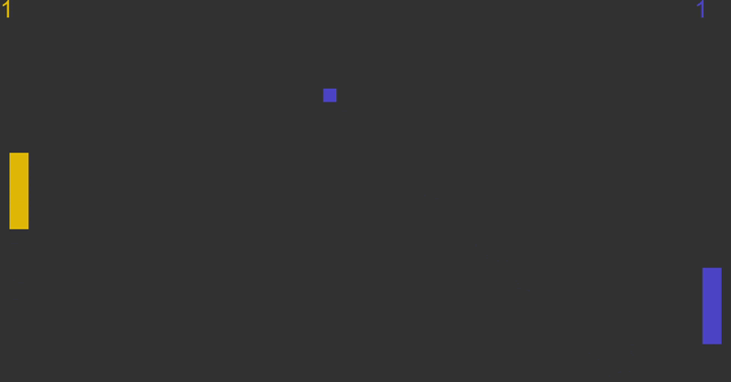
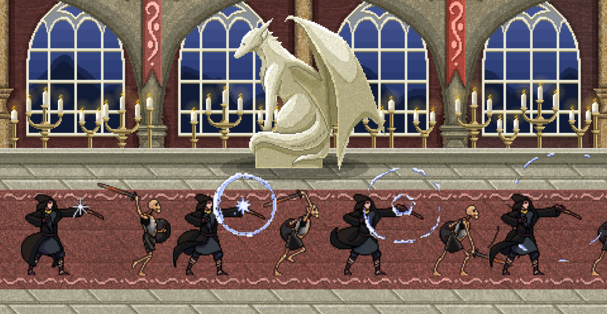
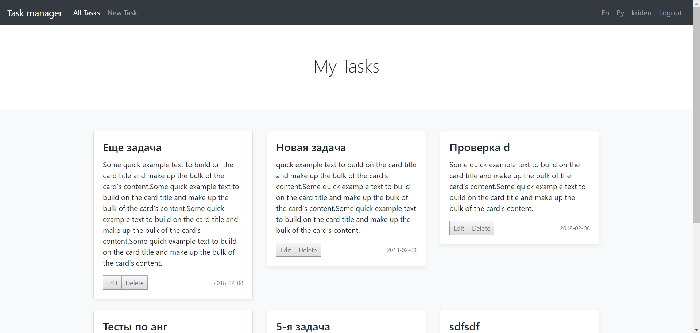

Here you can find info about my pet projects.
You might be interested in something &#128512;.

<h3 align="center" id="engine"><a href="https://github.com/denyskryvytskyi/ElvenEngine" target="_blank" class="content">Elven Engine</a></h3>

Game engine development from scratch in C++/OpenGL.
The main purpose is to learn more about game engine architecture, graphics programming, and how things actually work under the hood.

I try to minimize third-party libraries usage and develop all kinds of subsystems such as math lib, event system, renderer, ECS, etc.
There are a lot of features I've already implemented:
- custom math library
- cmake configuring/building
- platform agnostic Renderer API
- DSA OpenGL renderer including:
  - sprite batching rendering
  - text rendering
  - 2D/3D camera controllers
- event system with events queue
- Entity-Component system with Scene serialization
- ImGUI based dev-panels
- data-driven support using json library
- simple audio engine using irrKlang library

<video width="100%" height="100%" controls="controls">
  <source src="https://github.com/denyskryvytskyi/denyskryvytskyi.github.io/assets/25298585/700d08ef-6f58-4aba-896b-7606c10f9836" type="video/mp4">
</video>

<h3 align="center" id="engine"><a href="https://github.com/denyskryvytskyi/jali" target="_blank" class="content">Jali</a></h3>
My C++ implementation of the Lox programming language interpreter following Bob Nystrom's book Crafting Interpreters.

<h3 align="center" id="lia"><a href="https://github.com/denyskryvytskyi/lia" target="_blank" class="content">Lia</a></h3>

Custom math library to use in my projects, including game engine (Elven Engine).
Features:
- n-dimensional vectors
- 4x4-dimensional matrices
- transformations (translations, rotation, scale)
- utility (matrix transposition, inversion)
- orthographic and perpective projections matrices

<h3 align="center" id="bulletshot"><a href="https://github.com/denyskryvytskyi/Bulletshot" target="_blank" class="content">Bulletshot</a></h3>

2D multithreaded simulation of simple AABB collision. Reimplemented Bullets project in OpenGL. Also, one of the purposes was to create a small custom OpenGL 2D renderer.

<video width="100%" height="100%" controls="controls">
  <source src="https://user-images.githubusercontent.com/25298585/163442368-d3297b43-6644-4074-9c87-64761ba3a0ac.mp4" type="video/mp4">
</video>

<h3 align="center" id="snake"><a href="https://github.com/denyskryvytskyi/Snake" target="_blank" class="content">Snake</a></h3>

Console C++ snake game developed using some game programming patters.

<video width="100%" height="100%" controls="controls">
  <source src="https://user-images.githubusercontent.com/25298585/163442450-54785ec4-c6a4-45e9-ae93-47d4f28776b5.mp4" type="video/mp4">
</video>

<h3 align="center" id="bullets"><a href="https://github.com/denyskryvytskyi/Bullets" target="_blank" class="content">Bullets</a></h3>

SFML test project.
The main purpose is to implement AABB collision and multithreading to optimize bullet creation.
My first attempt to use multithreading to optimize many objects process in one scene.

<video width="100%" height="100%" controls="controls">
  <source src="https://user-images.githubusercontent.com/25298585/163442330-23624317-b263-4b30-b8bd-060281360152.mp4" type="video/mp4">
</video>

<h3 align="center" id="space"><a href="https://github.com/denyskryvytskyi/Project-Space" target="_blank" class="content">Project Space</a></h3>

Attempt to create an RPG-like game based on my Asteroids game.
Also, I used the MLAgents toolkit to create AI enemies through reinforcement learning.
Actually, my first attempt to use AI for game engines.
You can look at a little bit fake trailer for this game:

<video width="100%" height="100%" controls="controls">
  <source src="https://user-images.githubusercontent.com/25298585/163449028-ce7245ac-590e-4d24-a3cd-216ee6a4e772.mp4" type="video/mp4">
</video>

<h3 align="center" id="asteroids"><a href="https://github.com/denyskryvytskyi/Asteroids" target="_blank" class="content">Asteroids</a></h3>

Classic game developed in Unity game engine.

<video width="100%" height="100%" controls="controls">
  <source src="https://user-images.githubusercontent.com/25298585/163442211-6a777966-f63b-4d9e-8ac4-8fafe926a475.mp4" type="video/mp4">
</video>

<h3 align="center" id="unity">Unity small games</h3>

Small game projects I've made while learning how to use Unity, including 2D and 3D projects.
There are some of them: <a href="https://github.com/denyskryvytskyi/Cubetron" target="_blank" class="content">Cubetron</a> and <a href="https://github.com/denyskryvytskyi/Ballgame" target="_blank" class="content">Ballgame</a>

<h3 align="center" id="flowerfarm"><a href="https://github.com/denyskryvytskyi/Flower-farm" target="_blank" class="content">Flower farm</a></h3>

2D farm game developed with C++ and Cocos2d-x framework.
Developed in 5 days without previous knowledge of the cocos2dx library.
Also, I've tried to use component-oriented classes structure instead classic inheritance.

<video width="100%" height="100%" controls="controls">
  <source src="https://user-images.githubusercontent.com/25298585/163442406-036cb803-de4e-4647-92d8-7eb7e3240bb7.mp4" type="video/mp4">
</video>

<h3 align="center" id="taskmanager"><a href="https://github.com/denyskryvytskyi/TaskManager" target="_blank" class="content">Task manager</a></h3>
Java web project.
There are a bunch of different web pet projects I've developed in Java and PHP.
But this one is the most complete and favorite.
It was developed using Spring Framework (MVC/Data/Security).
It has a classic admin panel, login/logout with credential validation, and tasks manager with add/edit/delete functions.

<h3 align="center" id="battleship"><a href="https://github.com/denyskryvytskyi/Battleship" target="_blank" class="content">Battleship</a></h3>

My first complete programming project and game was developed in the 2015 year.
I developed it in two months using C++ and SFML libraries.
But the code was completely refactored maybe three times since that, and it looks more elegant for now:)

<video width="100%" height="100%" controls="controls">
  <source src="https://user-images.githubusercontent.com/25298585/163442276-ade2a688-689f-4cf4-9e08-e880599159a1.mp4" type="video/mp4">
</video>
